UNIVERSIDAD NACIONAL DE SAN AGUSTÍN

FACULTAD DE INGENIERIA DE PRODUCCION Y SERVICIOS

ESCUELA PROFESIONAL INGENIERÍA DE SISTEMAS

**MANUAL DE INSTALACIÓN**

**V1.0**

________________________________________________________________________

PROYECTO: Software para la Norma Técnica Peruana

Arequipa, 2017

**CONTROL DE LA DOCUMENTACIÓN**

________________________________________________________________________

**CONTROL DE LA CONFIGURACIÓN**

<table>
  <tr>
    <td>Título</td>
    <td>Manual de Instalación V1.0</td>
  </tr>
  <tr>
    <td>Autores</td>
    <td>Yucra Condori Carlos Alberto
Huallpa Tapia Luis David</td>
  </tr>
  <tr>
    <td>Fecha</td>
    <td>1 de Enero de 2017</td>
  </tr>
</table>

**HISTÓRICO DE VERSIONES**

<table>
  <tr>
    <td>Versión</td>
    <td>Fecha</td>
    <td>Estado</td>
    <td>Responsable</td>
    <td>Nombre de archivo</td>
  </tr>
  <tr>
    <td>1.0</td>
    <td>01/01/2017</td>
    <td>PROCESO</td>
    <td>Yucra Condori Carlos
Huallpa Tapia Luis David</td>
    <td>Manual de Instalación v1.0</td>
  </tr>
</table>

**HISTÓRICO DE CAMBIOS**

<table>
  <tr>
    <td>Versión</td>
    <td>Fecha</td>
    <td>Cambios</td>
  </tr>
  <tr>
    <td>1.0</td>
    <td>01/01/2017</td>
    <td>Primera versión</td>
  </tr>
  <tr>
    <td></td>
    <td></td>
    <td></td>
  </tr>
</table>

**CONTENIDO**

[[TOC]]

1. Software Necesario

    1. Instalación de Eclipse

Descarga

La versión de Eclipse con la que se trabajara es Eclipse Oxygen, esta versión se puede descargar en el siguiente enlace: [https://www.eclipse.org/home/index.php](https://www.eclipse.org/home/index.php)

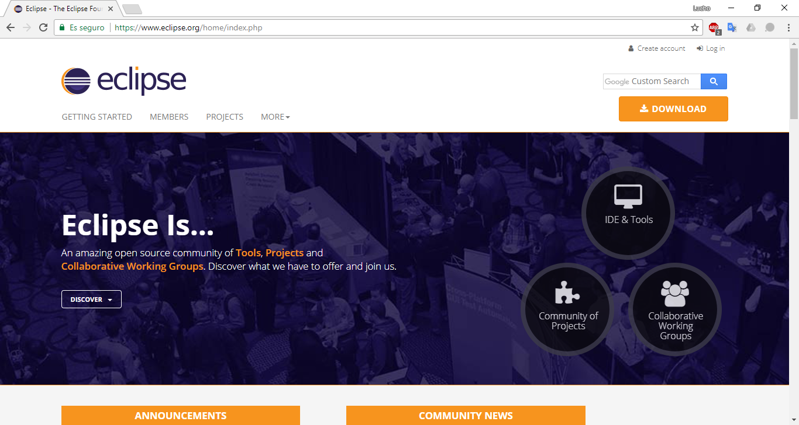

Se presiona el boton [Download](https://www.eclipse.org/downloads/) el cual nos redireccionara a la siguiente página:

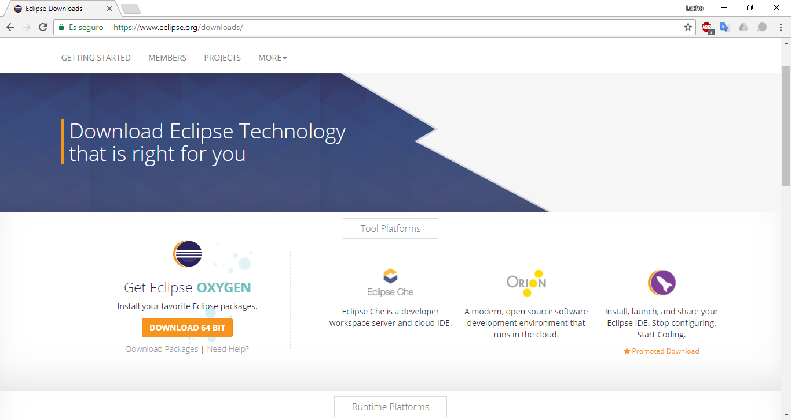

Hacer click en [Download 64 bits](https://www.eclipse.org/downloads/download.php?file=/oomph/epp/oxygen/R2/eclipse-inst-win64.exe) para iniciar la descarga.

Instalación

Luego de descargar el instalador de eclipse se procede a ejecutar el archivo .exe

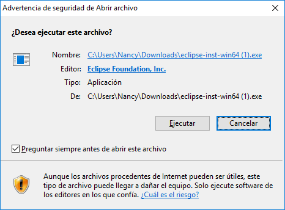

Al ejecutar el archivo .exe nos aparece el menú de selección, para el proyecto NTPQuest se debe utilizar Eclipse IDE for java EE Developers.

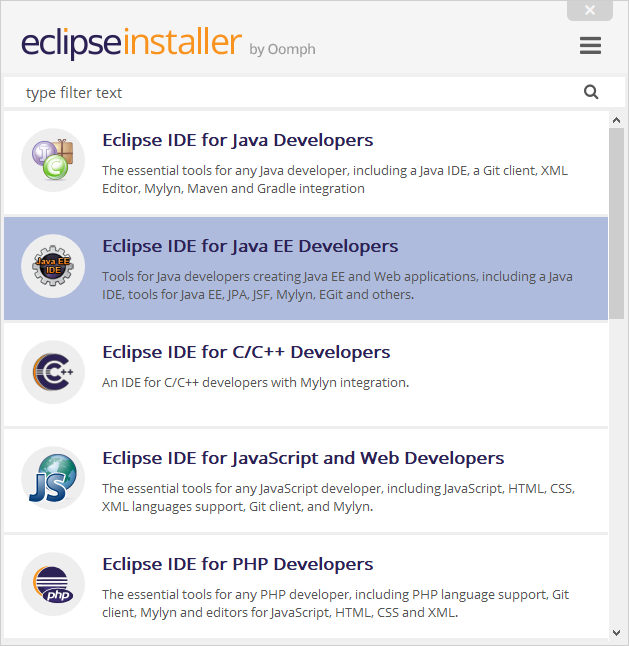

Se escoge la ruta donde se desea instalar eclipse y se instala.

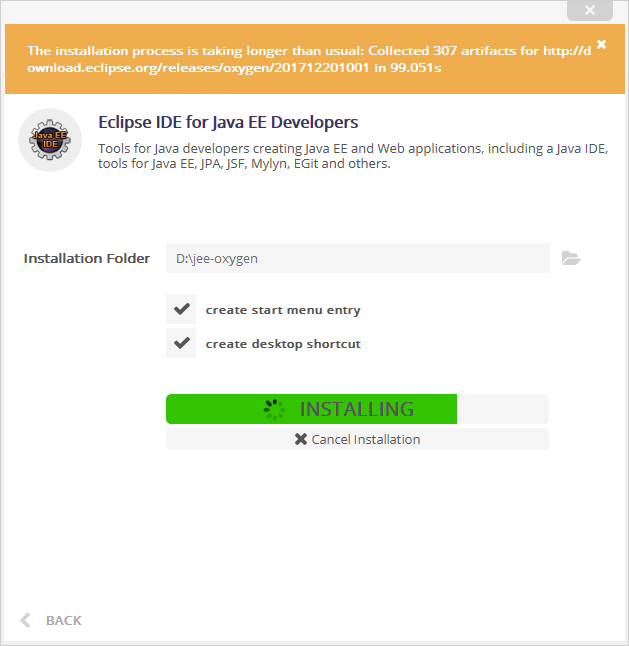

Al terminar el proceso de instalación nuestro IDE eclipse esta listo para usarse.

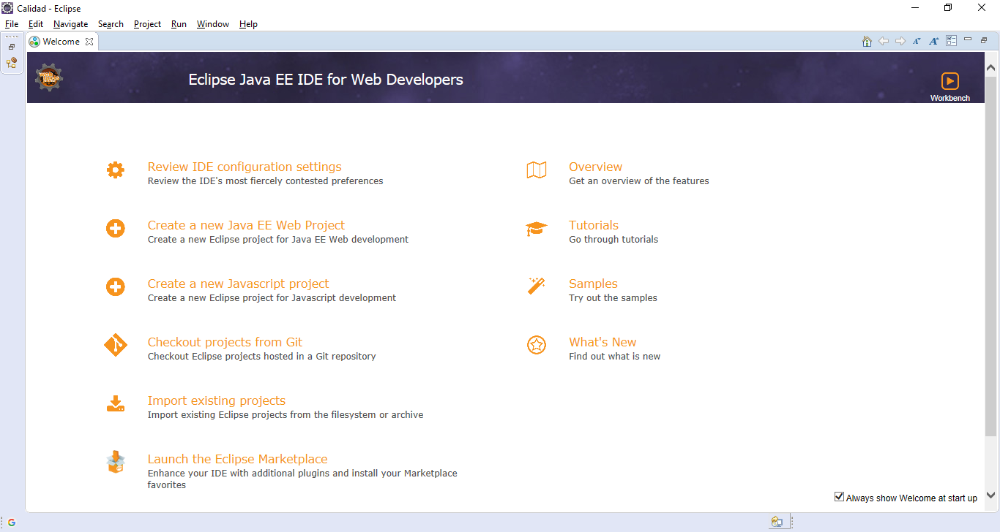

    2. Instalación de Xampp

Descarga

El servidor web que se utilizara es Xampp, ya que este software proporciona  un sistema de gestión de bases de datos MySQL y el servidor web Apache.

Para descargar Xampp se debe ingresar al siguiente enlace:

[https://www.apachefriends.org/es/index.html](https://www.apachefriends.org/es/index.html)

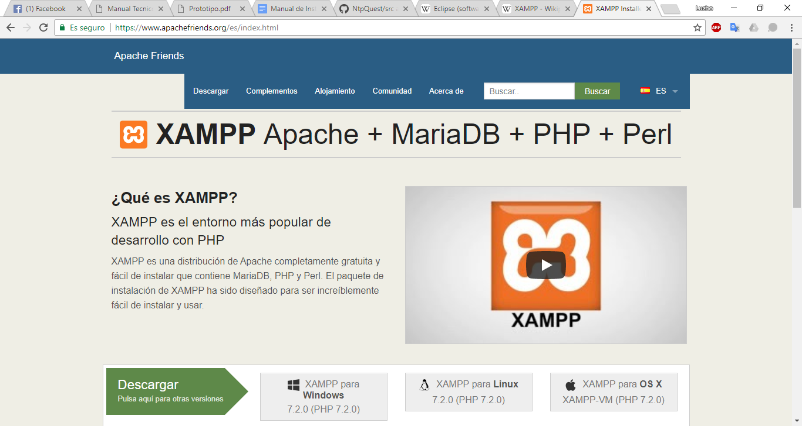

Se escoge el modo de descarga según el sistema operativo con el que se este trabajando.

Al finalizar la descarga ejecutar el archivo .exe y aparecera la siguiente ventana

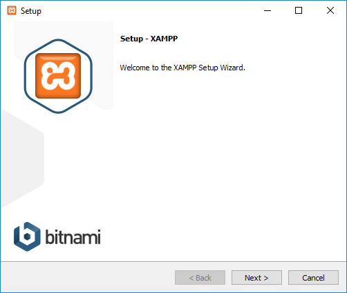

Se seleccionan los paquetes que se desean añadir

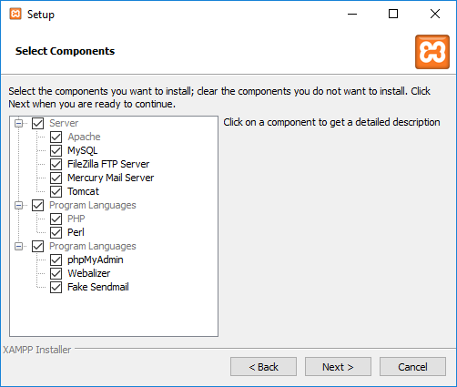

Se escoge el directorio donde se instalara Xampp

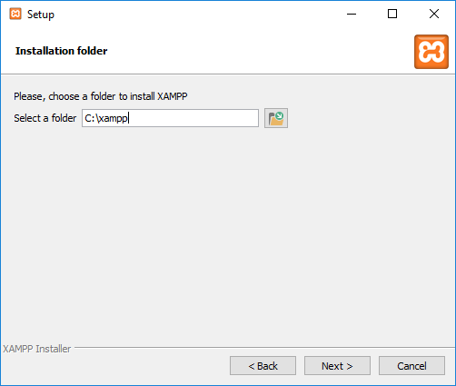

Al finalizar la instalación nos aparece el panel de control de X

### Instalación de Apache Tomcat 	

2. Configuración

    3. Importación de Base de Datos

    4. Clonación de Repositorio

Se realiza la clonación del repositorio con git de eclipse para lo cual se debe ingresar a su interfaz para lo cual se accede a show view como se ve en la imagen:

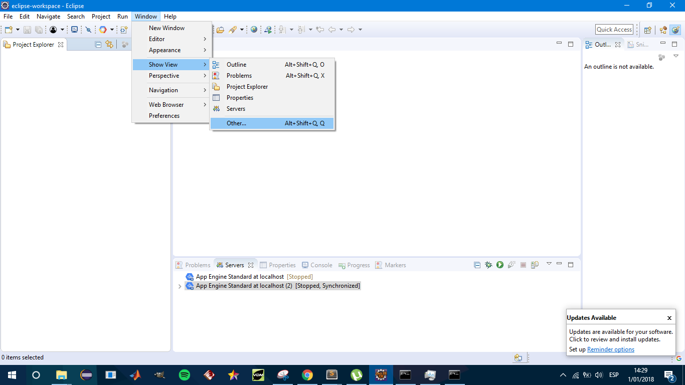

Luego se abre Git Repositories para realizar la clonación, como se muestra en la imagen:

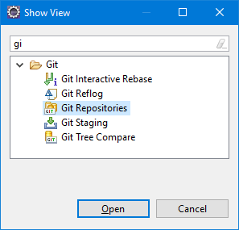

Se da click en **Clone a Git repository** como se muestra en la imagen.

Se ingresa la dirección [https://github.com/Juandeyby/NtpQuest.git](https://github.com/Juandeyby/NtpQuest.git) en URI, luego se presiona **NEXT** como se muestra la imagen:

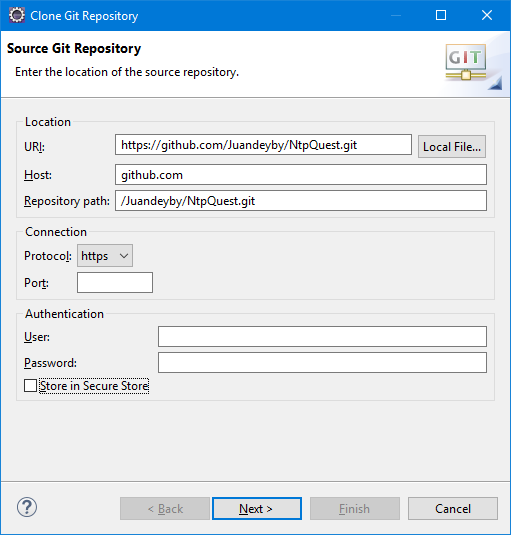

Seleccionan el branch de master y click en next.

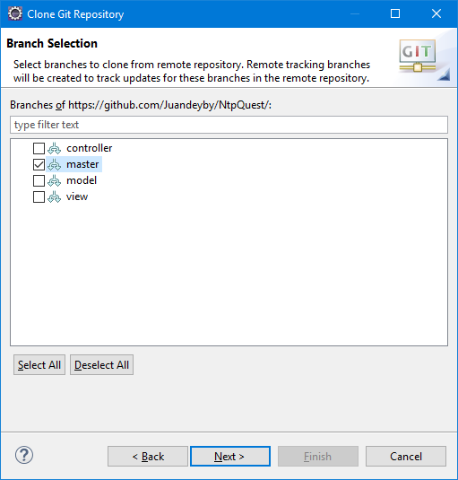

Click en finish.

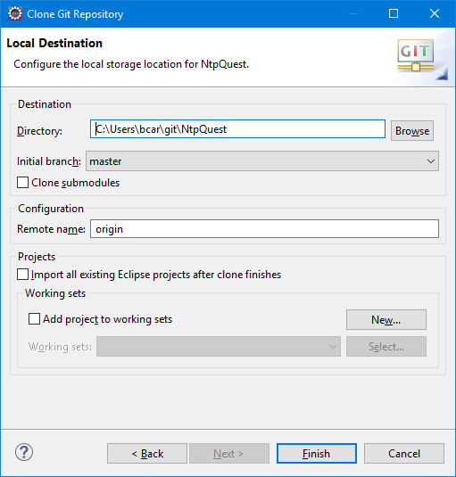

Una vez descargado, aparecerá los datos del repositorio:

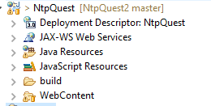

Se da click derecho en Working Tree e importar proyecto:

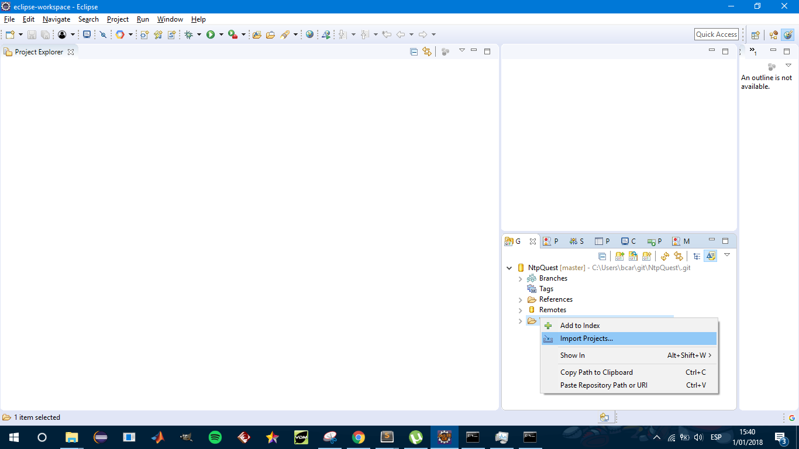

Y por ultimo click en Finish:

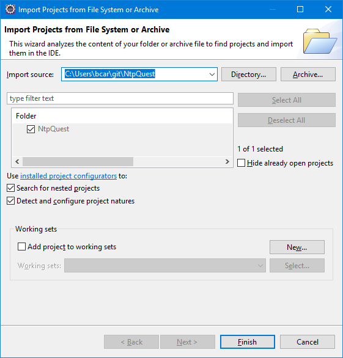

Con todo esto el proyecto está listo para despliegue local e internet, y para edición.

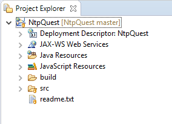

    5. Configuración de Base de Datos

Para configurar la base de datos se tiene que ingresar el código fuente con la ruta **"NtpQuest/Java Resource/src/model/MySQLConnectUtils.java"** donde nos aparecerá el código:

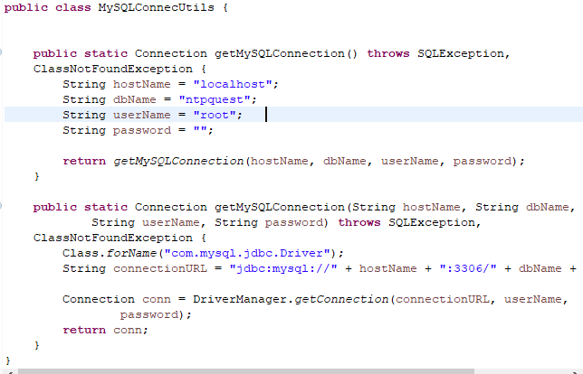

En **hostName = "localhost":** se puede cambiar localhost por la IP de la base de datos.

En **dbName = "ntpquest":** se puede cambiar ntpquest por el nombre de la base de datos.

En **userName= "root":** se puede cambiar root por el nombre de usuario para hacer la conexión con la base de datos.

En **password= "":** se ingresa la contraseña del usuario para hacer la conexión con la base de datos.

En la línea:

se puede cambiar el puerto 3306 por el puerto de la base de datos, por defecto en la mayoría de ocasiones es 3306.

    6. Configuración de Apache Tomcat

Primero se va a "**Windows/Show View/Servers" **para abrir la configuración de servers.

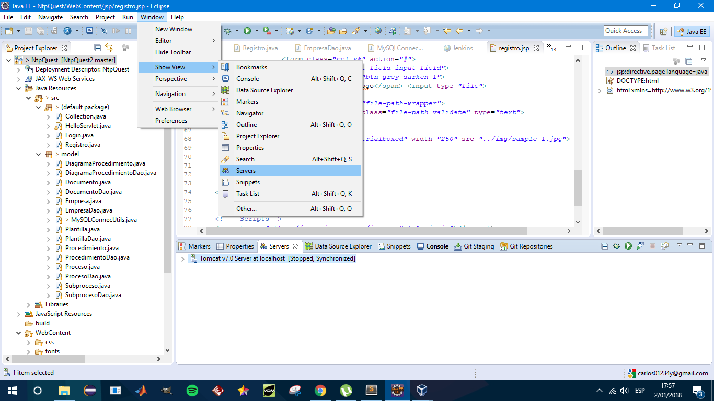

Se debe de hacer click en "**No servers are available. Click this link to create a new server...**"==> luego New, Server:

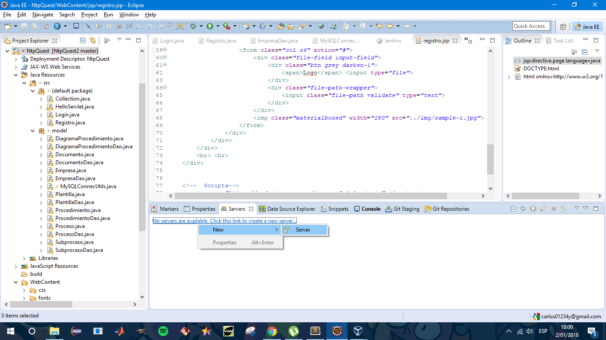

Se selecciona la versión de apache que se usará en este caso la 8 y click en Next.

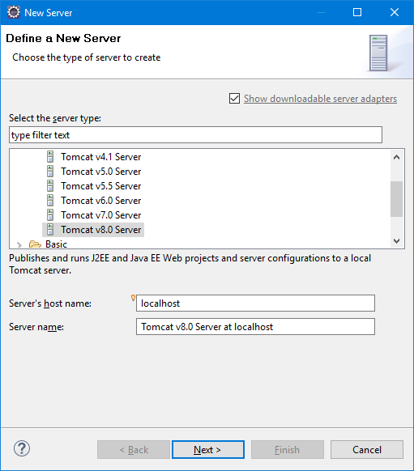

Luego ese selecciona la ruta donde se descargo apache 8.0 y Finish

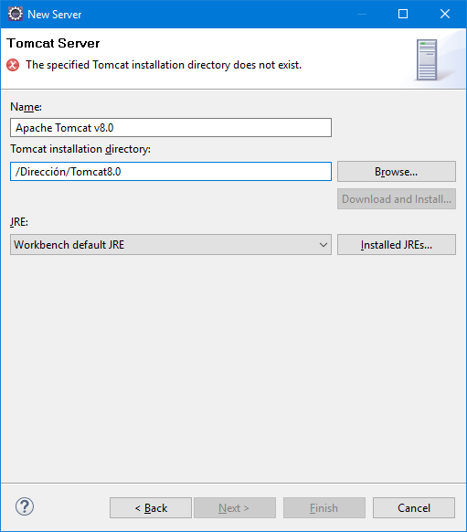

Luego aparecerá el servidor:

    7. Despliegue de aplicación

Se hace click derecho en el proyecto "**Run Ass/Run a Server"**.

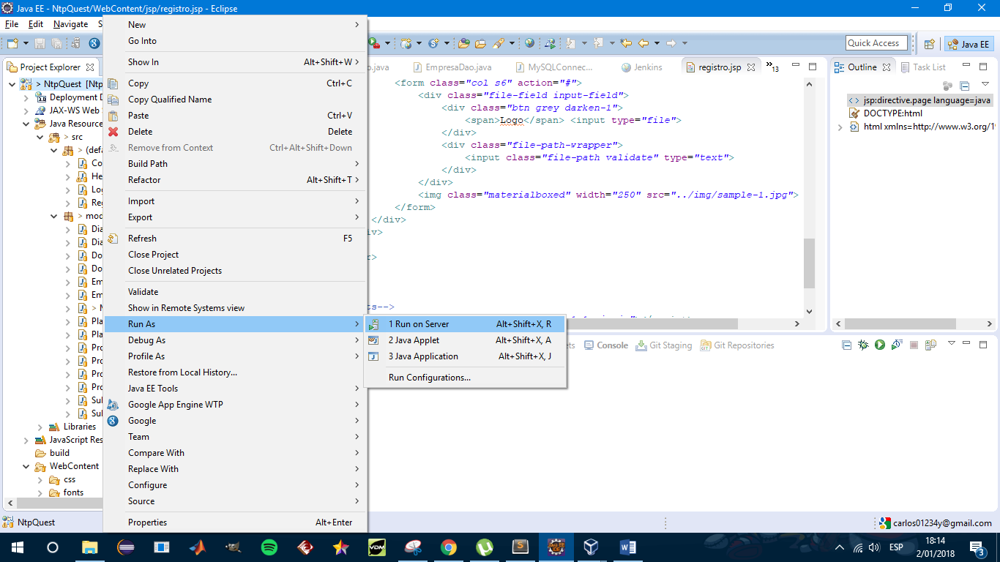

Seleccionan el servidor y Finish

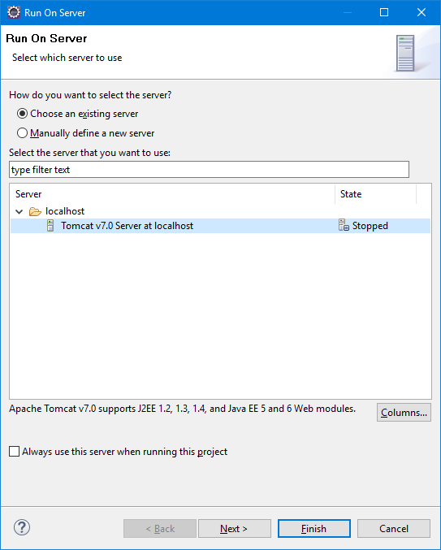

3. Apraissal

    8. Instalación de Apraisal

    9. Configuración de Apraisal
